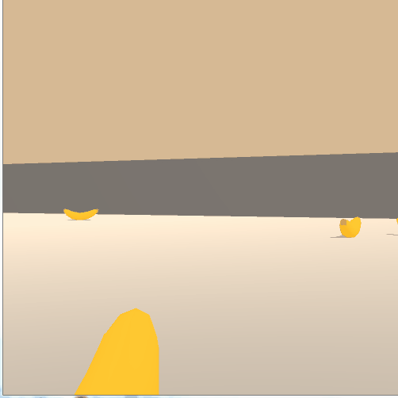
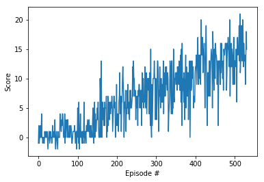

[//]: # (Image References)

[image1]: https://user-images.githubusercontent.com/10624937/42135602-b0335606-7d12-11e8-8689-dd1cf9fa11a9.gif "Trained Agents"
[image2]: https://user-images.githubusercontent.com/10624937/42386929-76f671f0-8106-11e8-9376-f17da2ae852e.png "Kernel"

# Deep Reinforcement Learning via Deep Q-Networks (DQN)

![Trained Agents][image1]

 

This repository is an example of using PyTorch and Unity ML-Agents for implementing a Deep Q-Network for reinforcement learning. The DQN is trained to play a banana collecting game, where the goal is to collect yellow bananas while avoiding the purple bananas. A modified version of the Unity ML-Agents Banana Collection example Environment is used for the demonstration. In this environment, the agent can turn left or right and move forward or backward. Each yellow banana collected brings a reward of +1, while purple bananas attract a reward of -1.  The target average score over 100 episodes is 13.  
 

### Repository contents

The repository includes the following DQN related files:
- `dqn_agent.py` -> dqn-agent implementation
- `model.py` -> example PyTorch neural network for vector based DQN learning
- `Navigation.ipynb` -> Python notebook for training and testing the DQN-agent.
- `banana_player_model.pth` -> saved weights for trained model.
- `Readme.md` -> This file.
- `report.md` -> Report file.
- `Banana.exe` -> Banana Unity environment. [(Reference)](https://github.com/Unity-Technologies/ml-agents)

## Background

### Learning algorithm

Q-learning is a reinforcement learning technique that technique does not require a model of the environment. Another benefit of Q-learning is that it can also handle problems with stochastic transitions and rewards, without requiring adaptations. Deep Q-learning combines with reinforcement learning a deep convolutional neural network. Layers of tiled convolutional filters mimic the effects of receptive fields. 

The DQN technique uses experience replay, a biologically inspired mechanism that uses a random sample of prior actions instead of the most recent action to proceed. This removes correlations in the observation sequence and smoothing changes in the data distribution. Iterative update adjusts Q towards target values that are only periodically updated, further reducing correlations with the target. [(Reference)](https://en.wikipedia.org/wiki/Q-learning)   

### Hyperparameters

The table below lists the hyperparameters used in the model. A brief description of the hyperparameters is provided below the table. 

| No. | Parameter | Value | 
|:----|:----------|:------|
|1| `eps_start`     |1   |
|2| `eps_end`       |0.01|
|3| `eps_decay`     |0.995  |
|4| `num_episodes`  |2000   |
|5| `max_score`     |13     |
|6| `BUFFER_SIZE`   |1e5    |
|7| `BATCH_SIZE`    |64     |
|8| `GAMMA`         |0.99   |
|9| `TAU`           |1e-3   |
|10| `LR`           |5e-4   |
|11| `UPDATE_EVERY` |4      |
|12| `fc1_units`    |64     |
|13| `fc2_units`    |64     |

-  `eps_start`, `eps_end`, `eps_decay`   The probability of choosing a random action will start at eps_start and will decay exponentially towards eps_end. eps_decay controls the rate of the decay.
- `num_episodes`: Number of episodes after which the algorithm will terminate regardless of whether the goal (average `max_score`) was achieved.
- `max_score`: The target average score   
- `BUFFER_SIZE`: Memory size for experience replay, a random sample of prior actions instead of the most recent action to proceed. 
- `BATCH_SIZE`: Batch size for optimization. Smaller batch size affected convergence stability. Larger batch size made the process very slow.   
- `GAMMA`: Discount factor for future rewards.       
- `TAU` : parameter for soft update of target parameters        
- `LR`: Learning rate for the above algorithm. Values from 0.01 to 0.1 were tried. Larger values were detrimental to getting a good final accuracy.          
- `UPDATE_EVERY`: How often to update the network
- `fc1_units`: Number of neurons in the first hidden layer of the neural network. 
- `fc2_units`: Number of neurons in the seocnd hidden layer of the neural network. 

### Environment

### Action Space
At each time step, the agent can perform four possible actions:
- `0` - walk forward 
- `1` - walk backward
- `2` - turn left
- `3` - turn right

### State Spaces 
The agent is trained from vector input data (not pixel input data)
The state space has `37` dimensions and contains the agent's velocity, along with ray-based perception of objects around agent's forward direction.  A reward of `+1` is provided for collecting a yellow banana, and a reward of `-1` is provided for collecting a purple banana. 

## Installation
Following are instructions for installing the environment that has been tested in a Windows 8 environment. 

### 
1. If not already install, download and install Anaconda Python 3.6+. [(Instructions)](https://www.anaconda.com/download/)

2. Create (and activate) a new conda environment called `drlnd`.
		
`conda create --name drlnd python=3.6`
	
`activate drlnd`

3. Clone this GitHub repository.
`git clone https://github.com/dzt109/banana_navigation.git.`

4. Navigate to the cloned repository, change to the `.python/` subdirectory and install dependencies 
		
`pip3 install .`

5. Install `pytorch` and `unityagents`

`conda install -y pytorch -c pytorch`

`pip install torchsummary unityagents`

6. Download the Banana environment. For this example project, you will not need to install Unity - this is because you can use a version of the Banana's unity environment that is already built (compiled) as a standalone application. Select the one that is appropriate for your operating system:

	
	- Linux: [click here](https://s3-us-west-1.amazonaws.com/udacity-drlnd/P1/Banana/Banana_Linux.zip)
	- Mac OSX: [click here](https://s3-us-west-1.amazonaws.com/udacity-drlnd/P1/Banana/Banana.app.zip)
	- Windows (32-bit): [click here](https://s3-us-west-1.amazonaws.com/udacity-drlnd/P1/Banana/Banana_Windows_x86.zip)
	- Windows (64-bit): [click here](https://s3-us-west-1.amazonaws.com/udacity-drlnd/P1/Banana/Banana_Windows_x86_64.zip)

7. Unzip (or decompress) the file in the main folder of the github repository. 

8. Start jupyter notebook from the `drlnd` conda environment
 
`jupyter notebook`
   
9. Launch the file `Navigation.ipynb`.
 
 
## Training

1. Run the notebook cell by cell and observe the results. 
2. Training happens in Cell 9, and completes when agents achieve an average score of *solved_score* over 100 runs.
3. The weights of the trained model are stored in the file: `banana_player_model.pth`
4. Cell 10 shows a plot of the scores achieved by the agent. The plot should look similar to the one shown below. While the training is going on, the output of the unity environment should look similar to [this video](https://www.youtube.com/watch?v=JHAdmHcH8g8&feature=youtu.be) 
5. Hyperparameters are present in `Navigation.ipynb`, `model.py` and `dqn_agent.py`. The training could be rerun after changing the hyperparameters. It is advised to change the weights `.pth` filename every time so that the model is not overwritten
 
 With the parameters set as in the file `Navigation.ipynb`, the target average score should be achieved within 300-600 episodes. 
 
 

## Testing
 1. Testing is performed in Cell 13 of the python notebook  `Navigation.ipynb`
 2. The cell will load the weights file and use the weights to determine actions for the agent.  
 3. Run the cell and observe the agent perform in the environment 
 4. In order to run with a different set of weights, change the model filename in Cell 12 and rerun Cell 13.
 5.  The output should look like shown below.

 

A longer video is available [here](https://www.youtube.com/watch?v=-DDHbOAvAj0&feature=youtu.be)

## Ideas for Future Work

It is possible to get a much higher average score than the required 13.0 with the current algorithm and hyperparameters. One idea for future work would be to explore the maximum average score achievable with current algorithms and settings. 
During the testing phase, it was found that sometimes the agents gets surrounded by purple bananas and therefore gets stuck. While that might well be a locally optimal policy, it is not clear if that is the globally optimal policy. It certainly is not a fun policy. Modifications to the rewards could be made to encourage the agent to keep moving. 

A few other things that would be interesting to try: 

- Implementing a [double DQN network](https://arxiv.org/abs/1509.06461): This is an adaptation of Q-learning that  eliminates issues with overestimation of action values as observed in the simple Q-networks.
- Implementing a [dueling DQN network](https://arxiv.org/abs/1511.06581): The dueling network represents two separate estimators: one for the state value function and one for the state-dependent action advantage function. This generalizes learning across actions without imposing any change to the underlying reinforcement learning algorithm.
- Implementing [prioritized experience replay](https://arxiv.org/abs/1511.05952): In this enhancement, important transitions are replayed more frequently, and therefore improving learning efficiency.  
- Training an agent from raw pixels: In this project, the agent learned from information such as its velocity, along with ray-based perception of objects around its forward direction. A more challenging task would be to learn directly from pixels, such as from an 84 x 84 RGB image, corresponding to the agent's first-person view of the environment.
